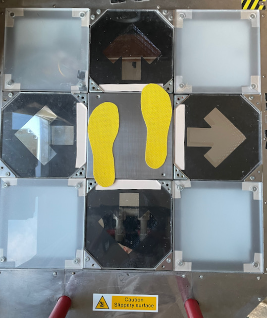
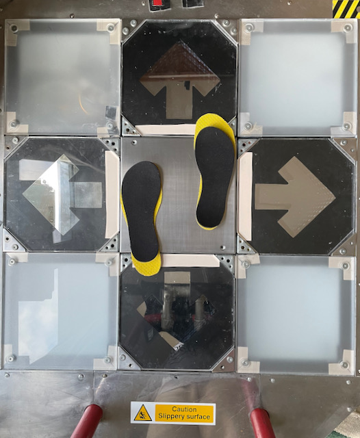
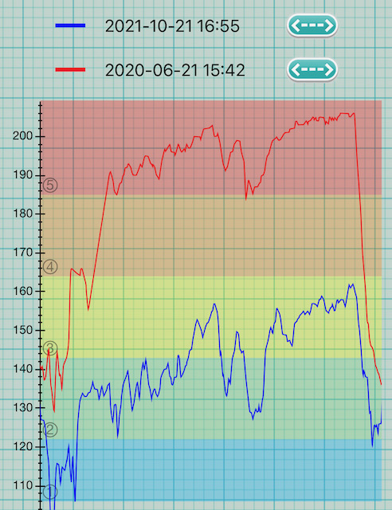

# Making stamina easier
A collection of ideas, mainly about form and posture, that I found make stamina gameplay easier.

Note: I am a small (5'4") human, and my observations will apply to, and mostly help, small humans. Average-size folks will likely not notice much difference, and larger folks will have their own set of challenges.

Warning: safely implementing one, let alone a few of these changes, requires time! Playing at your top level with a form you can poorly control will get you injured. Take it easy.

I hope this will inspire you to review your own gameplay, and make adjustments that may help you reach the next level!

# How I got here
I asked a sports coach to help me get better at stamina. They recommended I do most of my sessions at a heart rate between 120-140 BPM. I laughed and then I cried, because if I got on the pad and as much as sneezed, that was 120 already.
I spent weeks playing 9s (that's 9 levels below my max), and was very bored. My HR was in front of me in real time, so I started tweaking the form and looking for changes that would bring the HR down and allow me to play harder stuff.

# So what makes stamina easier?
I'll be looking at three factors:
- Muscle: how much work, especially static, the muscles are doing. Less work = lower HR.
- Range of motion: shaving a few cm per step, at tens of thousands of steps, makes a difference.
- Mental load: is that brain eating up the energy we need for playing?

Let's dive in.

## Muscle work
The first thing that obviously stood out to me: the more my muscles are engaged, the higher the HR. Most of the effort came from holding the posture that I chose for gameplay. There are ways to put that on a budget.

### Using a bar that fits
Arcade pads were built with an average-sized guy in mind. The further you are from that size, the worse it will fit ergonomically. Ergonomics are important, because a slight discomfort over hours and days of gameplay can develop into chronic pain or injury, and a good-fitting bar may keep you out of that. Shoulders, wrists, nerves, and even feet were helped with ergonomic bars. Check out [Bar mods](https://sereni.github.io/bar-mods/) for ideas.

Injuries aside, having control over the bar makes it easier to implement the following two strategies.

### Keeping the weight closer to the bar
When the weight is distributed between the bar and the feet, the back side of the body works to hold the body up. Think of it as a weird incline plank. It gets harder the further you move from a vertical position. To notice the effect quickly, try this:
1. Get on the pad and hold the bar as you normally do. Bring your attention to the back side of the body: calves, glutes, back, shoulders.
2. Now take a good step forward — heels on the up arrow — while still holding the bar. Notice how the same muscles work harder. Hold it here for a minute or two and get a little tired. The same thing is happening in (1), but slower.

Practically, this means that putting the weight in your heels is cheaper than putting it in your toes.
Try doing the same exercise, but this time, when you step forward, drive the weight into your heels first. After a bit, shift the weight into your toes and unload your heels to the point where you can lift them easily. How does that change the sensations in the back of the body? Standing on the up arrow exacerbates the effect, but the same happens slowly when playing in the center.

Even more practically, this means that the heels-out form makes your back work harder than the toes-out form. (Check out [Dom's overview](https://youtu.be/gwWgmGjeyRs) of these forms for other differences.)

### Keeping the weight off the bar
Of course the above stops being a problem if there's no weight on the bar to begin with. I do not advocate an all-or-nothing approach here, because the bar is massively useful for balancing, while loading the feet brings a host of other issues. That said, the amount of weight on the bar is an interesting metric, so here's a way to measure it.

Trigger warning: this method involves seeing your weight on the scale. If that's no fun to you, ask a friend to record the readings and do the math for you.
1. Put a bathroom scale onto the center panel. Stand on it and take a reading.
2. Reset the scale, step on it, grab the bar and do your best attempt at gameplay posture. It will feel slightly off, because the scale adds height. Also, the reading will fluctuate. Take the reading.
3. Divide 2nd reading by the 1st, multiply by 100, and that's the % of your body weight on the feet. 100 minus that number is the % of body weight on the bar.

Unloading the bar is a complex change, because it will likely force you towards a sliding form, as well as finding the right amount of grip, and perhaps discovering new muscles in the legs that didn't have to work as hard before. On the upside, it makes upper body soreness and injuries practically disappear.

> Not putting a ton of weight on the bar is like my favorite thing about my current form. My arms don't get tired/numb, my lower back doesnt hurt, and sliding just feels effortless so I feel like I don't spend much energy streaming. It's just real comfy. <...> I use my travel pad on top of my dedicab pads for stamina which makes the bar relatively shorter and it's a lot nicer. —teejusb

## Range of motion

As a general rule, moving less makes stamina gameplay easier. (Duh!) When I think about it, I remember a couple equations:

- distance = time x velocity (1)
- work = force x distance (2)

(1) matters because how fast your feet can move (_velocity_) is limited by your current physical ability. As the streams get faster, there is less _time_ to travel between the panels. The only way to keep velocity down is to decrease the _distance_ you have to travel.

As for (2), it roughly means that the effort to move something depends on how far it needs to go, and how heavy it is — or how much resistance, like pad friction, you encounter. Assuming your weight and pad friction don't change, traveling less means less work. Great!

### Limit vertical motion
Vertical motion is mostly feet lifting off the pad between steps, although it can also include the whole-body bounce that happens with it. I noticed that more vertical motion drives heart rate up, not only for the obvious reason that lifting anything takes effort. It also forces a stronger shift of balance from one side to another with every step, and a more loaded bar to keep the weight off the feet.

### Limit play area
That's a pretty obvious one — why step far into the panel when few centimeters do trick? Tightening the form is often the first advice to stamina beginners, and is in my opinion the single most impactful change. Here's an example player who may have started out moving as wide as the red area, is now in blue, and would further improve by learning to move only within the green area.

"But Sereni, I've been playing for 10 years, and my form is as tight as it gets! What else can I do?"
Not much, chap. Unless you could…

### Grow your feet
Very funny. But the effect on range is theoretically interesting, so let's have a look! Consider two players:
- Both have tight form. Let's define that as stepping only 2 cm (3/4 inch) beyond the center panel.
- Let us also assume both players can trigger the side panels on their way forward and back, and only focus on the travel between the up and the down arrow.

Here's what's different:
- Player 1's size is 28 cm (10 US men's, 43 EUR) — which is around the average men's shoe size.
- Player 2's size is 24 cm (6 US men's, 37.5 EUR) — that one is on the smaller side, but still common for women.

The center panel (together with the little gaps) is 28 cm, we allowed them 2 cm on the panels, so the total playing range is 28+2+2= **32 cm**.

To get from the up to the down arrow, P1's foot has to move 32-28= **4 cm**. Here's what it looks like:

To the same effect, P2's foot has to move 32-24= **8 cm**. Whoa, two times further! It looks like this:

What would it look like if P1 traveled as far as P2? It would make the blue circle we've seen in the section above, which is not quite the tightest form.

Curiously, for sizes past 28 cm, the travel distance increases again. That's because the player has to move off the panel between steps. However, they may choose a more angled stance, as opposed to parallel stance, to counteract that.

So, if you get to choose your foot size, go for 28 cm or so.

## Mental load

Things are about to get less scientific. Stuff below is something I can't explain or quantify, but it makes a performance difference.

### Scroll speed
Lower scroll speed (while still readable) helps me keep a lower heart rate. I suspect that reading larger chunks results in more planning time, smoother movement, and perhaps allows to relax the focus.

### Timing
Timing requires hard focus and finer muscle control, which is computationally intensive.

### Anxiety
This bitch never misses a competition, drives resting HR to the moon, locks the muscles, and plants intrusive thoughts into a brain that has streams to read. If anyone knows what to do with it, give me a shout!

### Change
When changing movement patterns, I found that my mental capacity was the biggest limiter. The brain is working extra hard to rewire, so if you jump into change also, be gentle on yourself. Good news: when the new movement finally becomes automatic, it feels heavenly. Look, I can think while playing again!

# Fin
Thanks for reading! I hope you found something interesting, surprising, or useful. What's your favorite tip? Will you try any? What did I miss? Find me on Stamina Nation discord and give me a shout.

—Sereni

# P.S. Did it work?
Yeah. I applied a number of learnings and changed my form from "steppy, bar-heavy, heels-out" to "sliding, light on the bar, toes-out". The heart rate difference looks cool. This is `[17][180] Signal`:

Caveats:
- Both attempts are near my top level at the time. Why is my top level the same one year later? Because rebuilding form from scratch dropped me down 8 levels and 80 BPM. I took the second sample as soon as I could play at this speed and level again.
- There are 6 months of training between these graphs, of which 3 months was low HR cardio training, which should have improved my cardio fitness. That said, my resting HR, and HR in activities like walking and cycling have not changed.
- I have not tried to record a new attempt with the form I used previously, because I no longer have good command of it.

Here's another, `[16][165] Bright colors`:

On the first attempt, I was comfortable with 165, but not a fan of 20-minute efforts. The second attempt is taken after practicing 165 for a few months with the improved form.

In addition to heart rate changes, I got rid of nerve damage, wrist pain, and overwhelming soreness after every session. Win!
